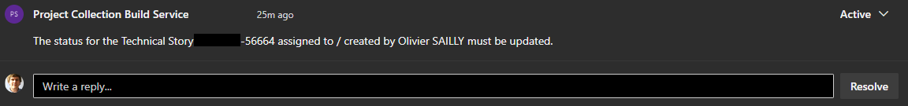

# Linking a PR to its JIRA Card

## Introduction

### Retrieve DATA From JIRA

As stated in the tagging section, our PR Description template allows us to retrieve the JIRA Card Keys: what if we could add even more tags to it by actually reading the JIRA Cards?

With this stage, it is now possible: the task will retrieve the card and add up to three tags: the **version**, the **card type** and the **MMF**.

#### Pull Request Overview

The JIRA basic information pieces are now easily found when having a look at a PR:


### Checking the JIRA Card Status

Gaining access to the card is not only useful to add tags, viewing its status also enables us to enrich the PR with a comment when the card has to be moved:



Once the card is moved and has the right status, if another build is ran, a reminder is posted as `resolved` to move the card again when the PR is merged:


### Automatically create a Technical Story

Most of the untracked work was a hassle to declare in JIRA and was previously just done without a JIRA Card linked to it.

Not anymore!

When the description does not contain a JIRA Card, this stage will create it as a TS, update the PR Description with a footer, and also tag it, all at once.

#### Created Card Overview

The PR Title is used to fill up the card's one, and the rest is generated using the provided config. Only the version and the MMF have to be set manually, because these are dynamic and cannot be retrieved easily.


### Q&A

#### Why not moving the card automatically?

This is a great question, but as of today the JIRA REST API does not enable it.

## Usage

_Notes: all complex objects are passed through as `string` (JSON-serialized) in environment variables, and lists are passed along with another variable containing the number of elements they contain to avoid unecessary parsing and other issues such as a variable not being set if a list is empty._

### Set Up

In your build pipeline, link this repository:

```yaml
resources:
  repositories:
    - repository: happy-jira-link
      type: github
      endpoint: MyGitHubConnection
      name: AxaGuilDEv/happy-jira-link
```

_To set up a GitHub connection, have a look [here](https://learn.microsoft.com/en-us/azure/devops/pipelines/library/service-endpoints)._

Then in your stages, call this template:

⚠ _This template must be dependant on a stage exporting **CurrentPullRequestAttributes.JiraIdList** (a JSON-serialised list of `string` containing the JIRA keys) and **CurrentPullRequestAttributes.JiraIdListCount**. We recommend using this repository's tagging stage which is built to work together with this stage._

```yaml
stages:
# ...

- template: jira/jira-stage.yml@happy-jira-link
  parameters:
    dependsOn: AnotherStage # this variable defaults to tagging
    repositoryAlias: 'happy-jira-link'
    organizationName: 'MyCompany'
    projectName: 'MyProject'
    jira:
      # The group must contain a variable called "jira_pat" (the PAT as a secret)
      variableGroup: 'olisail-jira-pat-group'
      baseUrl: 'https://jira.my.intranet'
      projectId: '12345'
      appCode: '12345'
      tribeId: '12345'
      domainId: '12345'
      squadId: '12345'

# ...
```
