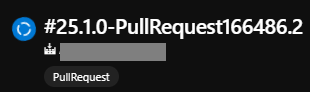
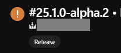
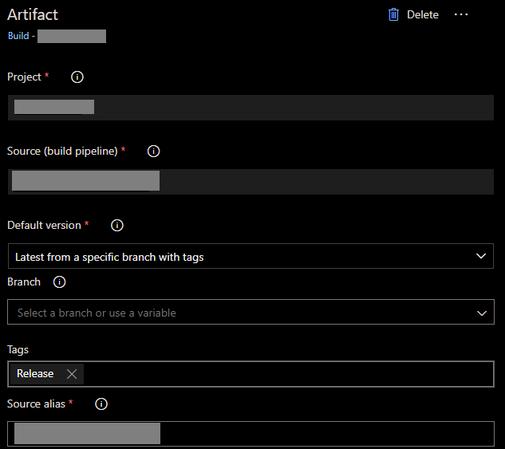

# PR & Pipeline Tagging

## Introduction

### Pipeline Tagging

When having a single pipeline publishing different artifacts for different purposes (e.g. a pipeline running differently when the purpose is to verify a pull request or building to publish artifacts), it could be useful to have a tag to restrict the release generation to fit only our needs (i.e. generate releases only when the build purpose is to publish the artifacts).

To do that, we chose to use the `Build.Reason` variable exposed by Azure DevOps.

#### Pipeline Overview

Build tagged as PullRequest:



Build tagged as Release:



Then, when linking an artifact:



### Pull Request Tagging

When having standards on PR Description Redaction such as mentionning a JIRA card, some things can be done to enhance visibility for everyone.
We chose to locate automatically in PR descriptions the JIRA cards and tag the PR using the JIRA Keys.

_The JIRA Keys are also exported in Azure Variables in order to facilitate the actual JIRA Cards lookup, check the JIRA section for more information._

#### Pull Request Overview

The JIRA keys are now easily found when having a look at a PR:


## Usage

### Set Up

In your build pipeline, link this repository:

```yaml
resources:
  repositories:
    - repository: happy-jira-link
      type: github
      endpoint: MyGitHubConnection
      name: AxaGuilDEv/happy-jira-link
```

_To set up a GitHub connection, have a look [here](https://learn.microsoft.com/en-us/azure/devops/pipelines/library/service-endpoints)._

Then in your stages, call this template:

```yaml
stages:
# ...

- template: tagging/tagging-stage.yml@happy-jira-link
  parameters:
    dependsOn: AnotherStage # this variable defaults to []
    repositoryAlias: 'happy-jira-link'
    organizationName: 'MyCompany'
    projectName: 'MyProject'
    jiraBaseUrl: 'https://jira.my.intranet' # a base URL without the last '/'

# ...
```

### PR Descriptions

For the automatic tagging to occur, a link has to be posted in the PR description with the following format: `https:\/\/jira\.my\.intranet\/browse\/(?<jiraId>[a-zA-Z]+\-\d+)`.

We recommand using a footer such as the following:

```markdown
# My PR Title

## Features / Fixes / Notes

- Lorem ipsum dolor sit amet

------

_Technical Story: [KEY-12345](https://jira.my.intranet/browse/KEY-12345)_
```
